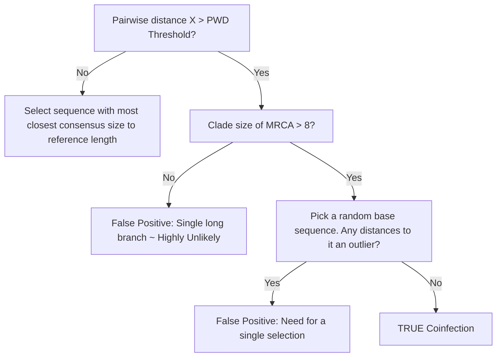
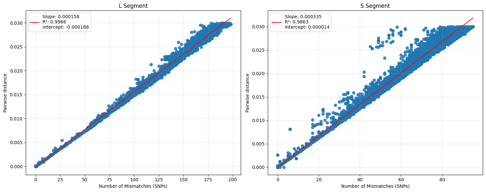

# LASV Deduplication Pipeline

[](https://github.com/Joon-Klaps/lasvdedup/actions/workflows/conda-test.yml?query=workflow%3AConda)

A small snakemake pet project for deduplicating LASV (Lassa virus) sequences, from the output of the [viralgenie pipeline](https://github.com/Joon-Klaps/viralgenie)

For the deduplication we set 3 (+1) empirical thresholds:
- Threshold:
    - L: 0.00072
    - S: 0.00093
- Clade size threshold: 8
- (Z-threshold for outliers: 2)



The Concept is that sequences with a divergence higher then the `--pairwise-distance` threshold, are unlikely to have occured from a single infection. To go double check this, the algorithm checks if the sequences are apart of a clade with more then `--clade-size` members. If the sequences are closely located (small clade), we assume that this is a false positive and they still belong to a single infection. If it is larger then the clade threshold and we don't see any outlying large branches (`> median absoulut deviance * z-threshold`), we assume that this is a true coinfection.

## Installation

```bash
# Installation with pip
pip install -e .

# Or using conda
conda env create -f environment.yml
conda activate lasvdedup-env
pip install -e .
```

## Usage

```bash
# Example command
lasvdedup --help
```

## Development

To run tests:

```bash
pytest tests/
```

## How to determine the Pairwise distance thresholds?

From the literature we found that the rate of evolution of LASV is approx. $8 * 10^{-4}$ substitutions per site per year.
For the L and S segment we have 7.2kb and 3.4kb respectively.
Which means for the L segment, we expect approximately 5.76 or 6 substitutions per year, and for the S segment, approximately 2.72 or 3 substitutions per year.

Next, we plotted the number of substitutions vs branch lengths



The branch lengths would be:
-   L : 5.76 \* 0.000158 + -0.000188 = <ins>0.00072</ins>
-   S : 2.72 \* 0.000335 + 0.000014 = <ins>0.00093</ins>
