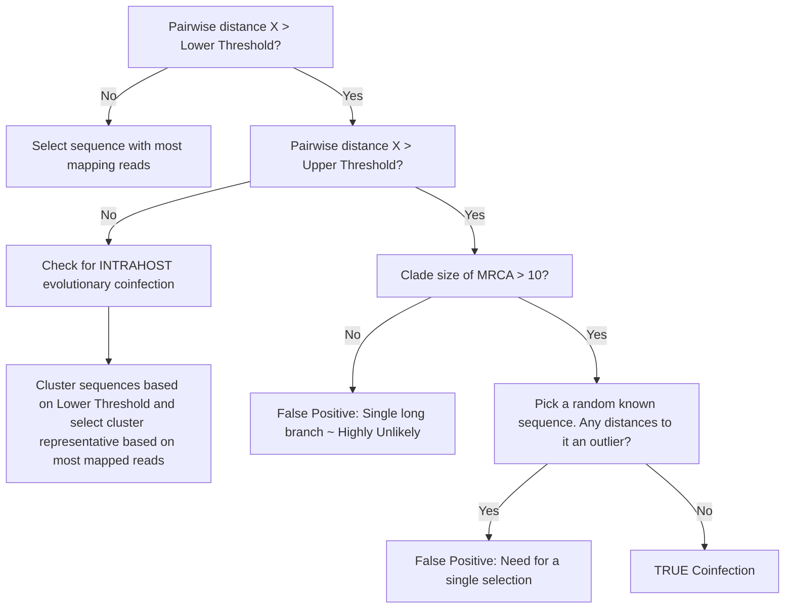

# LASV Deduplication Pipeline


A small snakemake pet project for deduplicating LASV (Lassa virus) sequences, from the output of the [viralgenie pipeline](https://github.com/Joon-Klaps/viralgenie)

For the deduplication we set 3 (+1) empirical thresholds:
- Lower threshold: 0.02
- Upper threshold: 0.05
- Clade size threshold: 10
- (Z-threshold for outliers: 2)



The Concept is that a natural intrahost codivergence evolution has occured within an expected range of `Lower Threshold` and `Upper threshold`. When the divergence is higher then `Upper threshold` we check how closely related the genomes are. If they are apart of a clade with more then `Clade size threshold` members, we assume that the divergence is due to a coinfection event - given that one of the branches towards a random selected reference is not an outlier. If the clade is smaller then `Clade size threshold` we assume that the divergence is due to a false positive as the clade is small yet there is a very large divergence present.


## Installation

```bash
# Installation with pip
pip install -e .

# Or using conda
conda env create -f environment.yml
conda activate lasvdedup-env
pip install -e .
```

## Usage

```bash
# Example command
lasvdedup --help
```

## Development

To run tests:

```bash
pytest tests/
```

